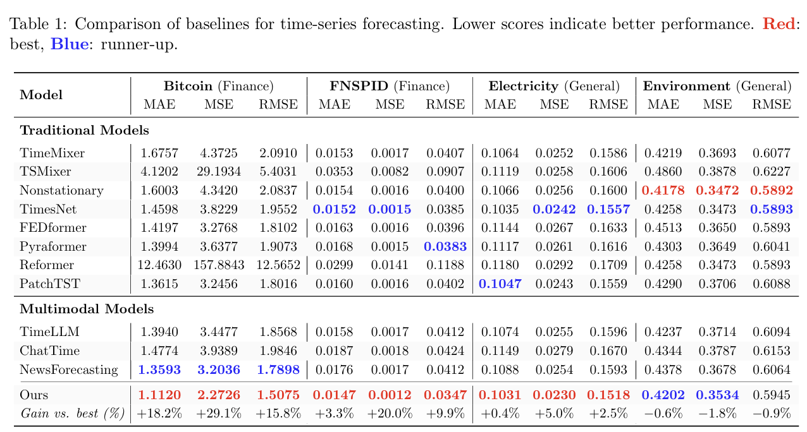

<div align="center">


<br/><br/>

# 🌉 TESS

### **From Text to Forecasts: Bridging Modality Gap with Temporal Evolution Semantic Space**

<br/>

*Lehui Li\* · Yuyao Wang\* · Jisheng Yan\* · Wei Zhang · Jinliang Deng† · Haoliang Sun · Zhongyi Han · Yongshun Gong†*


<br/>

[]([https://arxiv.org](https://arxiv.org/abs/2603.12664))
[](https://github.com/olivia3395/TESS)
[](#)

</div>


## 🔍 Overview

Incorporating textual information into time-series forecasting holds promise for addressing **event-driven non-stationarity** — yet a fundamental modality gap hinders effective fusion: textual descriptions express temporal impacts *implicitly and qualitatively*, whereas forecasting models rely on *explicit and quantitative* signals.

Through controlled semi-synthetic experiments, we show that existing methods over-attend to redundant tokens and struggle to reliably translate textual semantics into usable numerical cues. **TESS** bridges this gap by introducing a **Temporal Evolution Semantic Space (TESS)** as an intermediate bottleneck between modalities, consisting of interpretable, numerically grounded temporal primitives extracted from text by an LLM via structured prompting and filtered through confidence-aware gating.

<br/>

<div align="center">

| Problem | TESS's Solution |
|:---|:---|
| Existing methods over-attend to redundant tokens | Distill text into compact, prediction-relevant temporal primitives |
| Qualitative text resists decoding into numerical gains | Define numerically verifiable primitives (distribution shift, volatility, shape, lag) |
| LLM extraction can be noisy or unreliable | Confidence-aware gating suppresses erroneous primitive injections |
| Direct text fusion leads to unstable optimization | Semantic prefix tokens enable smooth, fast convergence |

</div>


## 🔬 Diagnosing the Modality Gap

Before proposing TESS, we conduct controlled semi-synthetic experiments on **FNSPID** to understand *why* existing text-fusion methods fail.

**Finding 1 — Attention Distraction:** Even when text provably contains predictive signals, existing fusion models systematically over-attend to redundant tokens. The focus ratio $R_t = \log(\bar{\alpha}_\text{sig} / \bar{\alpha}_\text{red})$ is negative for the vast majority of test samples, indicating that predictive signals are consistently ignored.

**Finding 2 — Representational Mismatch:** Even after completely removing all redundant tokens (Signal-Only), performance remains substantially worse than directly using the equivalent numerical features. Textual signals — even perfectly isolated — resist decoding into quantitative forecasting gains.

These two findings reveal a *fundamental* bottleneck: the modality gap is not merely a noise problem, but a representational mismatch between qualitative language and quantitative time series.


## 🏗️ Method: TESS Framework

<div align="center">

<br/><sub><b>Figure 1:</b> Overview of TESS. A frozen LLM extracts temporal evolution primitives via structured prompting. After confidence-aware gating, these primitives condition a PatchTST-based forecaster as semantic prefix tokens.</sub>
</div>

<br/>

### Stage 1 · Temporal Evolution Semantic Space

We predefine four **Temporal Semantic Primitives (TSPs)** that are numerically verifiable — given observation and forecast windows, ground-truth values can be uniquely computed, providing reliable supervision for the gating mechanism.

| Primitive | Description | Example Categories |
|:---|:---|:---|
| **Distribution Shift** $p_{\Delta\mu}$ | Standardized mean change between history and forecast | `STRONG-RISE`, `MILD-RISE`, `STABLE`, `MILD-DROP`, `STRONG-DROP` |
| **Volatility Shift** $p_{r\sigma}$ | Log-ratio of first-order difference std between windows | `STRONG-RISE`, `MILD-RISE`, `STABLE`, `MILD-DROP`, `STRONG-DROP` |
| **Shape** $p_\text{shape}$ | Inter-patch trend sequence encoding evolution morphology | `ASCEND`, `DESCEND`, `PEAK`, `TROUGH`, `OSCILLATE` |
| **Lag & Decay** $p_\text{lag}$ | Onset timing and persistence of event impact | `EARLY-FADE`, `EARLY-PERSIST`, `MID-FADE`, `MID-PERSIST`, `LATE`, `DIFFUSE` |

### Stage 2 · Text → Temporal Semantic Primitives

A frozen LLM classifies each primitive by computing log-likelihood scores over the finite candidate set under a structured prompt $\mathcal{D}_k$. Temperature-scaled softmax yields both a discrete prediction $\hat{v}_{t,k}$ and a calibration distribution $q_{t,k}(\cdot)$.

A **confidence-aware gating network** then estimates the reliability of each extracted primitive using the log-probability margin between top-1 and top-2 candidates:

$$m_{t,k} = \log q_{t,k}(v^{(1)}) - \log q_{t,k}(v^{(2)})$$

The gate $g_{t,k} \in [0, 1]$ suppresses unreliable primitives during inference, with the gated representation $\tilde{h}_{t,k} = g_{t,k} \cdot h_{t,k}$.

> 💡 **Theoretical Guarantee:** Under a mild Lipschitz assumption, an incorrect primitive's influence on prediction error is attenuated proportionally to $g_{t,k}^2$ (Theorem A.7). Semantic compression also provably tightens the generalization bound (Theorem A.5).

### Stage 3 · Semantic Primitives-Conditioned Forecasting

The $K$ gated semantic vectors are stacked as **semantic prefix tokens** $P \in \mathbb{R}^{K \times d}$ and concatenated with patch embeddings from PatchTST:

$$Z^{(0)} = [P; E_\text{patch}] \in \mathbb{R}^{(K+N) \times d}$$

Prefix fusion allows semantic information to participate in temporal modeling throughout all Transformer attention layers. The model is trained end-to-end (LLM frozen) with a joint objective:

$$\mathcal{L} = \mathcal{L}_\text{fcst} + \lambda \mathcal{L}_\text{gate}$$


## 📊 Results

### Main Results (4 Real-World Datasets)

<div align="center">

<br/><sub><b>Figure 2:</b> TESS vs. all baselines. Bold red = best, bold blue = runner-up.</sub>
</div>

<br/>

<div align="center">

| Dataset | Domain | TESS (MAE) | TESS (MSE) | Best Baseline (MSE) | Gain |
|:---|:---:|:---:|:---:|:---:|:---:|
| Bitcoin | Finance | **1.1120** | **2.2726** | 3.2036 (NewsForecasting) | **+29.1%** |
| FNSPID | Finance | **0.0147** | **0.0012** | 0.0015 (TimesNet) | **+20.0%** |
| Electricity | General | **0.1031** | **0.0230** | 0.0242 (TimesNet) | **+5.0%** |
| Environment | General | 0.4202 | 0.3534 | 0.3472 (Nonstationary) | −1.8% |

</div>

TESS outperforms all unimodal and multimodal baselines by up to **29% in MSE** on financial datasets with pronounced non-stationarity.

### Non-Stationary Scenario Analysis

<div align="center">

<br/><sub><b>Figure 3:</b> Performance across three non-stationary scenarios (Shape transition, Volatility change, Distribution shift). TESS achieves consistent MSE reductions of 21–52% over multimodal baselines and 21–45% over unimodal baselines.</sub>
</div>

### Ablation Study

<div align="center">

| Dataset | w/o TESS (MSE) | w/o Gating (MSE) | Full TESS (MSE) |
|:---|:---:|:---:|:---:|
| Bitcoin | 4.2238 (+46.2%) | 2.3556 (+3.7%) | **2.2726** |
| FNSPID | 0.0018 (+29.4%) | 0.0015 (+2.6%) | **0.0012** |
| Electricity | 0.0298 (+22.8%) | 0.0248 (+7.5%) | **0.0230** |

</div>

TESS drives the primary performance gains, while confidence-aware gating further enhances robustness against LLM extraction errors.


## 🚀 Quick Start

### Installation

```bash
# Python 3.8+ recommended
pip install torch>=2.0.0
pip install transformers accelerate
pip install numpy pandas scikit-learn
pip install einops

# Install remaining dependencies
pip install -r requirements.txt
```

> **Datasets** are available via the project repository. Place them under `../dataset/` or configure `--data_path` accordingly.

### Running Experiments

#### 1 · Unimodal Baseline (PatchTST, No Text)

```bash
sh run_baseline.sh
```

#### 2 · Direct Text Fusion Baseline

```bash
sh run_direct_fusion.sh
```

Or run manually:

```bash
python run_direct_fusion.py \
  --dataset FNSPID \
  --model PatchTST \
  --epoch 100 \
  --log_screen True
```

#### 3 · TESS (Our Method) ⭐

```bash
python run_tess.py \
  --dataset FNSPID \
  --use_tess True \
  --use_gating True \
  --llm_model Qwen3-8B \
  --epoch 100 \
  --log_screen True \
  --data_path ../dataset/
```

### Primitive Extraction (Offline Preprocessing)

```bash
python extract_primitives.py \
  --dataset FNSPID \
  --llm_model Qwen3-8B \
  --output_path ../dataset/primitives/ \
  --temperature 1.0
```

> 💡 **Tip:** Primitive extraction is performed **offline** as a preprocessing step. The online forecaster consumes only compact primitive labels, keeping inference lightweight and fast.


## ⚙️ Key Hyperparameters

| Parameter | Description | Default |
|:---|:---|:---:|
| `--lambda_gate` | Weight for gating supervision loss $\lambda$ | `0.1` |
| `--temperature` | LLM softmax temperature $T$ for primitive extraction | `1.0` |
| `--patch_len` | PatchTST patch length $P$ | `16` |
| `--stride` | Patch stride $S$ | `8` |
| `--d_model` | Transformer hidden dimension $d$ | `128` |
| `--n_heads` | Number of attention heads $H$ | `8` |
| `--n_layers` | Number of Transformer encoder layers $M$ | `3` |
| `--epoch` | Training epochs | `100` |
| `--patience` | Early stopping patience | `10` |
| `--lr` | Learning rate (AdamW) | `1e-4` |
| `--dataset` | Target dataset name | `FNSPID` |
| `--llm_model` | LLM for primitive extraction | `Qwen3-8B` |

> 💡 **Tip:** For datasets with mild non-stationarity (e.g., Electricity, Environment), reducing `--lambda_gate` to `0.05` can further stabilize training. Use `--use_cv True` for automatic hyperparameter selection via cross-validation.


<div align="center">
<sub>Built with ❤️ for better multimodal time-series forecasting under event-driven non-stationarity · ICML 2026</sub>
</div>
