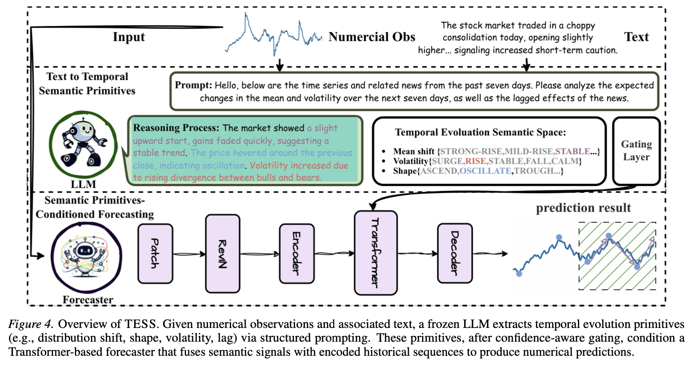

````markdown
<div align="center">

<!-- ======================= -->
<!--        HERO BADGES      -->
<!-- ======================= -->

<p>
  
  
  
  
</p>

<br/>

<h1>
  TESS
</h1>

<h3>
  From Text to Forecasts: Bridging Modality Gap with Temporal Evolution Semantic Space
</h3>

<p>
  <b>ICML 2026 Oral</b> &nbsp;·&nbsp;
  Text-Augmented Time-Series Forecasting &nbsp;·&nbsp;
  Temporal Semantic Primitives
</p>

<br/>

<p>
  Lehui Li<sup>*</sup> · Yuyao Wang<sup>*</sup> · Jisheng Yan<sup>*</sup> · Wei Zhang · 
  Jinliang Deng<sup>†</sup> · Haoliang Sun · Zhongyi Han · Yongshun Gong<sup>†</sup>
</p>

<p>
  <sup>*</sup> Equal contribution &nbsp;&nbsp; 
  <sup>†</sup> Corresponding authors
</p>

<br/>

<p>
  <a href="https://arxiv.org">
    
  </a>
  <a href="https://github.com/olivia3395/TESS">
    
  </a>
  <a href="#">
    
  </a>
</p>

</div>

<br/>

---

## ✨ Overview

Real-world time series are rarely shaped by numbers alone.  
News, weather shocks, policy changes, market sentiment, and social events often trigger abrupt temporal shifts that are first expressed in **text** before they appear in historical observations.

Yet directly feeding raw text into forecasting models is unreliable: textual descriptions are qualitative, noisy, and often semantically redundant, while forecasting models require explicit, quantitative temporal signals.

**TESS** introduces a **Temporal Evolution Semantic Space** as an interpretable bridge between language and forecasting. Instead of using raw text as an opaque auxiliary modality, TESS asks a frozen LLM to extract compact temporal primitives — such as distribution shift, volatility, shape, and lag — and injects them into a forecasting backbone through confidence-aware semantic prefix tokens.

<br/>

<div align="center">

| What makes text hard for forecasting? | How TESS addresses it |
|:---|:---|
| Text is qualitative, but forecasting is quantitative | Converts text into numerically grounded temporal primitives |
| Raw tokens contain redundant or irrelevant descriptions | Distills text into compact semantic signals |
| LLM outputs may be noisy or uncertain | Uses confidence-aware gating to suppress unreliable primitives |
| Direct multimodal fusion can destabilize training | Injects semantic prefix tokens into the Transformer backbone |

</div>

<br/>

---

## 🧠 Core Idea

TESS treats text not as a sequence of tokens to be blindly fused, but as a source of **structured temporal hypotheses**.

<div align="center">

```text
Textual Event Description
          │
          ▼
Frozen LLM Extractor
          │
          ▼
Temporal Semantic Primitives
  ┌────────────┬────────────┬────────────┬────────────┐
  │   Shift    │ Volatility │   Shape    │    Lag     │
  └────────────┴────────────┴────────────┴────────────┘
          │
          ▼
Confidence-Aware Gating
          │
          ▼
Semantic Prefix Tokens
          │
          ▼
PatchTST Forecasting Backbone
````

</div>

<br/>

---

## 🏗️ Method

<div align="center">
  
</div>

<br/>

TESS follows a three-stage pipeline.

### 1. Temporal Evolution Semantic Space

We define four **Temporal Semantic Primitives** that describe how an external event may affect the future trajectory of a time series.

<div align="center">

| Primitive              | Meaning                                                    | Forecasting Role                                  |
| :--------------------- | :--------------------------------------------------------- | :------------------------------------------------ |
| **Distribution Shift** | Whether the future level changes after the event           | Captures upward/downward regime changes           |
| **Volatility**         | Whether uncertainty or fluctuation increases               | Captures instability after external shocks        |
| **Shape**              | Whether the trajectory follows a specific temporal pattern | Captures trend, spike, drop, or recovery behavior |
| **Lag**                | Whether the event impact is delayed                        | Captures temporal response delay                  |

</div>

These primitives are designed to be both **language-extractable** and **numerically verifiable** from the forecast window, enabling supervised learning of semantic reliability.

---

### 2. Text-to-Primitive Extraction

A frozen LLM maps each textual description into primitive labels using structured prompting.
To reduce the effect of unreliable LLM predictions, TESS estimates extraction confidence from the log-probability margin between the top candidate and the runner-up candidate.

The confidence-aware gate softly weights each primitive, allowing the model to preserve reliable semantic signals while suppressing noisy ones.

---

### 3. Primitive-Conditioned Forecasting

The gated primitive embeddings are prepended to the time-series patch embeddings as **semantic prefix tokens**.
This lets semantic information interact with temporal representations throughout all Transformer layers.

The model is trained end-to-end with a joint objective combining:

* forecasting loss,
* primitive supervision,
* confidence-aware gating supervision.

The LLM remains frozen during training.

<br/>

---

## 📊 Results

Across four real-world datasets, TESS consistently improves text-augmented forecasting performance over both unimodal and multimodal baselines.

<div align="center">

| Setting              | Key Observation                                                          |
| :------------------- | :----------------------------------------------------------------------- |
| Unimodal forecasting | Historical signals alone miss event-driven shifts                        |
| Direct text fusion   | Models often over-attend to redundant tokens                             |
| TESS                 | Structured primitives provide stable and interpretable semantic guidance |
| Ablation studies     | Removing gating or primitive bottlenecks degrades performance            |

</div>

<br/>

> TESS achieves up to **29% reduction in forecasting error** compared with strong unimodal and multimodal baselines.

<br/>

---

## 🚀 Quick Start

### Installation

```bash
git clone https://github.com/olivia3395/TESS.git
cd TESS

conda create -n tess python=3.8
conda activate tess

pip install -r requirements.txt
```

### Data Preparation

Place datasets under:

```text
./dataset/
```

Expected structure:

```text
dataset/
├── dataset_name/
│   ├── train.csv
│   ├── val.csv
│   ├── test.csv
│   └── text/
```

### Run Training

```bash
python run.py \
  --model TESS \
  --data ETTh1 \
  --seq_len 96 \
  --pred_len 96 \
  --patch_len 16 \
  --stride 8 \
  --d_model 128 \
  --n_heads 8 \
  --n_layers 3 \
  --lambda_gate 0.1 \
  --llm_model Qwen3-8B
```

### Run Evaluation

```bash
python evaluate.py \
  --checkpoint checkpoints/tess_best.pth \
  --data ETTh1 \
  --pred_len 96
```

<br/>


## ⚙️ Key Hyperparameters

<div align="center">

| Argument        | Description                              |   Default  |
| :-------------- | :--------------------------------------- | :--------: |
| `--lambda_gate` | Weight for confidence-gating supervision |    `0.1`   |
| `--temperature` | LLM softmax temperature                  |    `1.0`   |
| `--patch_len`   | Patch length                             |    `16`    |
| `--stride`      | Patch stride                             |     `8`    |
| `--d_model`     | Transformer hidden dimension             |    `128`   |
| `--n_heads`     | Number of attention heads                |     `8`    |
| `--n_layers`    | Number of Transformer encoder layers     |     `3`    |
| `--epoch`       | Maximum training epochs                  |    `100`   |
| `--patience`    | Early stopping patience                  |    `10`    |
| `--lr`          | Learning rate                            |   `1e-4`   |
| `--llm_model`   | Frozen LLM extractor                     | `Qwen3-8B` |

</div>

<br/>


